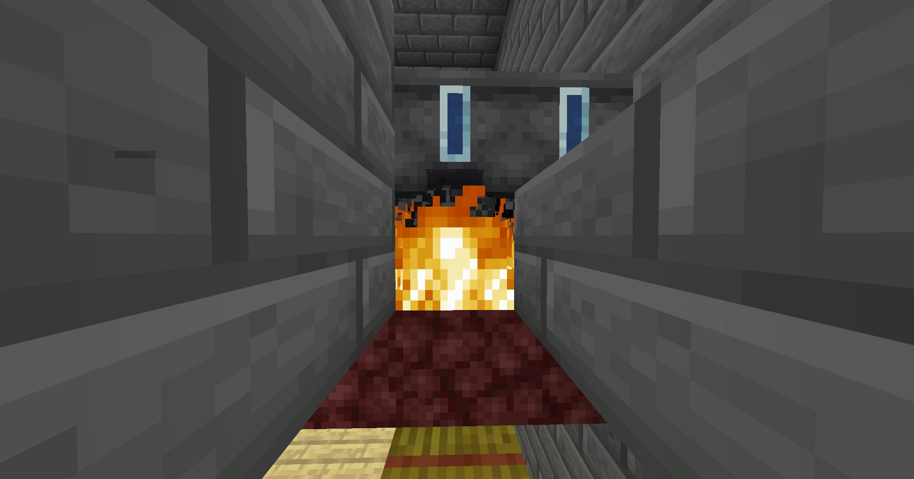
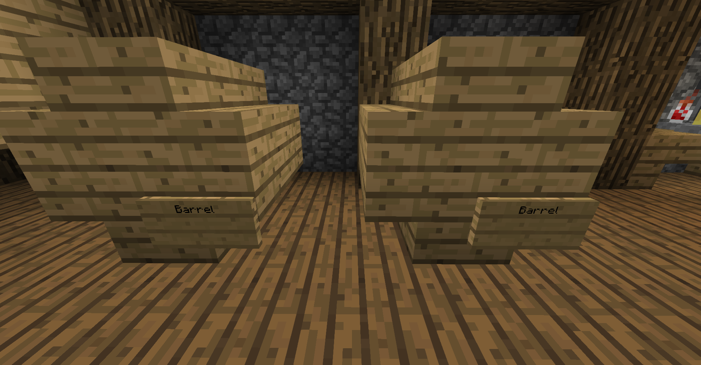
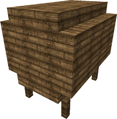
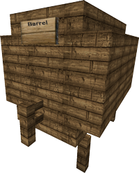

# 1.Introduction
らーすの酒の造り方です。

# Step1. 発酵
必要なもの:  
 * 大釜
 * 火打ち石とうちがね
 * ネザーラック

まずネザーラックを設置し、その2つ上に大釜を設置し、ネザーラックに火をつけます。

下の写真みたいになってたらok

その後、釜に**右クリック**で下の表に対応する素材を正確に入れます。一つでも多かったり少なかったりすれば星5の可能性は無くなります。

|完成品|材料|発酵|蒸留|熟成|熟成期間(星5)|
|------|---|----|----|----|----|
|小麦ビール|小麦 3個|8分|-|要|1年|
|ビール|小麦　6個|8分|-|要|1年|
|赤ワイン|スイートベリー　5個|5分|-|要|15年|
|ミード|サトウキビ　6個|3分|-|要|2年|
|アップルサイダー|リンゴ　14個|7分|-|要|不明|
|リンゴ酒|リンゴ　12個|16分|3回|要|不明|
|ウィスキー|小麦　10個|10分|2回|要|不明|
|香ばしいラム酒|サトウキビ　18個|6分|2回|要|13年|
|ウォッカ|ポテト 10個|15分|3回|-|-|
|ポテトスープ|ジャガイモ　5個/草　3個|3分|-|-|-|
|コーヒー|ココア豆　12個/牛乳　2個|2分|-|-|-|

熟成期間の情報はIssueまでお待ちしております。

発酵の列に書いてある時間発酵させた後、空き瓶で釜の中の水を回収します。

時計で釜を右クリックすることで何分発酵させたか確認することができます。

特殊な名前(赤ワインならGrape mustなど)が付いていれば問題ありません。

もし作っているお酒の欄の蒸留に伸ばし棒以外が書いているならば、Step2に進み、それ以外かつ熟成の欄に伸ばし棒以外が書いているならばStep3へお進みください。

# Step2. 蒸留
蒸留するには、醸造台が必要です。醸造台に一個だけグロウストーンダストを入れ、先程作成したお酒を投入します。燃料はいりません。

放置していれば必要な分のみ蒸留してくれますが、何回蒸留されたか確認し、必要な数より少ないのであれば入れ直すなどをして必要な数まで蒸留してください。(何回蒸留されたかは、◯-times Distilledの◯の部分で確認できます。)

次が熟成です。なお、ウォッカのように熟成の欄に伸ばし棒が書いてあるレシピは熟成は必要ありません。完成です。おめでとうございます。

# Step3. 熟成
熟成するには樽が必要です。マイクラ標準の樽でもいいですし、Breweryの専用樽でも大丈夫です。

マイクラの樽だと6個まで。小型バレルで9スロット、大型バレルで27スロットです。

お試しで作る目的でないならば、基本的に大型バレルを作ったほうがよろしいです。もし雰囲気を重視するならば小型バレルも最適かもしれません。

小型バレルを作るには8つの木の階段を使って樽の形を作り、
右下に看板を置き、上の行に「Barrel」と書きます。 (画像のように)

大型バレルは5つのフェンス、16個の木の階段、18個の木材を使用して、樽の形を作り、フェンスと「Barrel」と書かれた看板を取り付けます。 

星5のお酒を目指すなら最適な熟成期間を目指し熟成します。

マイクラ内での一日が一年熟成したことになり、200日以上熟成させるとHundreds of year barrel agedとなり、それ以上熟成することはありません。

# 飲む
飲みすぎると良くない。
